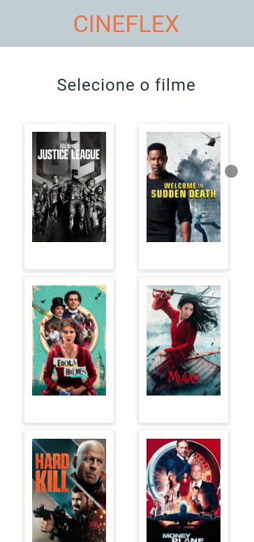

 <h1>Cineflex</h1>
 
 <p><b>Cineflex</b> is an app that emulates the experience of purchasing cinema movie tickets, from choosing the movie from the cinema catalog to selecting the seats. </p>
 <p align='center'>
  
</p>

<h1> About </h1>

<p> This web application allows the user to simulate the ticket booking process. Below are the implemented features:</p>

<ul>
  <li> Movie Catalog </li>
  <li> Dates and times available </li>
  <li> Seats map of the chosen room and their availability </li>
  <li> Name and personal ID document inputs </li>
  <li> Success page with the personal and movie session infos </li>
 </ul>

<h1>Technologies</h1>
<p>The following tools and frameworks were used in the construction of the project:</p>


<h1> How to run </h1>

<ol>
  <li>Clone this repository</li>
  <li>Open Terminal in your code editor of preference</li>
  <li>Change the current working directory to the location where you want the cloned directory</li>
  <li>Type git clone, and then paste the URL you copied earlier.</li>
</ol>
<p>
  
``` 
git clone https://github.com/YOUR-USERNAME/YOUR-REPOSITORY 
```
</p>
<ol start='5'>
  <li>Press enter to create your local clone</li>
  <li> Open the directory where you put your cloned repository with your code editor</li>
  <li> In the terminal of your code editor, run the command below to install the necessary dependencies:</li>
</ol>

<p>
  
``` 
npm i
```
</p>

<ol start='8'>
  <li>Now, to run the code on your web browser, just type the command below:</li>
</ol>

<p>
  
``` 
npm run start
```
</p>

<ol start='9'>
  <li>Enjoy!</li>
</ol>


